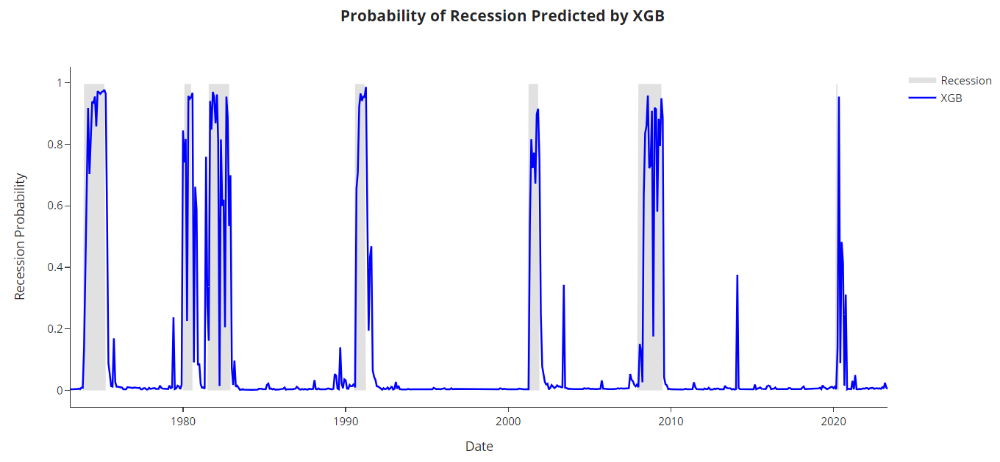
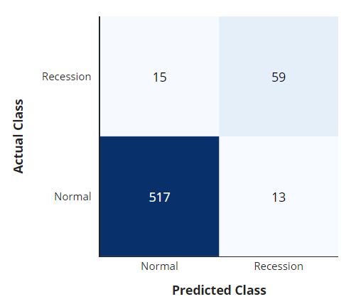
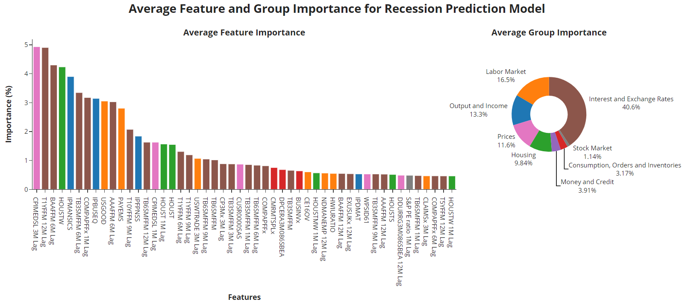

   
   

     

# **Forecasting Economic and Market Regimes**

     

>This repository is public-facing and exists solely for the purpose of showcasing how machine learning can be leveraged for forecasting economic and market regimes.

     

## **1. Introduction**

Welcome to the "Forecasting Economic and Market Regimes" project. The primary objective of this project is to forecast economic regimes, with a specific focus on predicting recessions. The core significance of this endeavor lies in its potential impact on the field of asset management, particularly in catering to the needs of long-term investment strategies. However, the benefits of these predictive models extend beyond the realm of asset management. Other stakeholders, including policymakers, business executives, and individuals, can also leverage these insights for their own purposes. Policymakers can devise proactive measures to mitigate the impact of economic downturns, executives can make informed decisions to guide their businesses through challenging times, and individuals can take preemptive actions to safeguard their financial stability. In the latter phase of the project, we broaden our scope to encompass the prediction of market crash regimes, as well.

## **2. Methodology**

In this project, we navigate our journey through a structured and time-tested methodology. Our chosen guide is the **[CRISP-DM (Cross-Industry Standard Process for Data Mining)](https://www.ibm.com/docs/en/spss-modeler/saas?topic=dm-crisp-help-overview)** framework—an adept and versatile approach that crafts a methodical roadmap for data-centric ventures. This established methodology ensures that our analysis is not only comprehensive and insightful but also harmoniously aligned with our overarching business goals.

   
   

The CRISP-DM methodology encompasses the following cardinal phases:

1. Business Understanding
2. Data Understanding
3. Data Preparation
4. Modeling
5. Evaluation
6. Deployment (Please note: The deployment stage remains outside the scope of this project, as we are focused on presenting data science insights rather than operational deployment.)

## **3. Dataset Information**

Here's a concise overview of the datasets we've used in our project:

- **FRED-MD Dataset for Features**: We've harnessed the FRED-MD (Federal Reserve Economic Data - Macroeconomic Database) to extract a comprehensive set of macroeconomic variables. These variables capture the intricacies of economic conditions, enhancing the accuracy of our analyses.

- **NBER Business Cycles Dating for Economic Regime Labels**: Our economic regime labels are derived from the NBER business cycles dating dataset. This authoritative source provides precise indications of economic expansion and recession periods, forming a solid foundation for our predictive models.

- **𝓁1-Trend-Filtering Technique for Market Regime Labels**: To label market regimes, we've employed the 𝓁1-trend-filtering technique.

All datasets underwent meticulous preprocessing, including cleaning, normalization, and alignment, ensuring the reliability of our analyses. For detailed preprocessing and utilization specifics, consult the individual notebooks and analysis files within the repository.

## **4. Selected Results**

In the process of model selection for predicting economic regimes, XGBoost outperformed other competitors examined in the project. Here are the selected results and visualizations for predicting economic regimes with a horizon of one month ahead:

   

In the above figure, you can see the probability of recession predicted by the XGB model over time. This visualization provides insights into the model's ability to anticipate economic downturns.

   

In the above figure, you can explore the confusion matrix generated by the XGBoost model for predicting economic regimes. This visualization offers a comprehensive overview of the model's performance in distinguishing between normal economic periods and recessionary phases.

   

The figure illustrates the aggregated feature importance and group importance, which were generated in the model interpretation section of the project. This analysis sheds light on the key variables that contribute to our forecasting model

## **5. Project Structure**

The structure of this repository is organized as follows:

   <pre>
📦 forecasting-economic-and-market-regimes
┣ 📂 data
┃ ┗ 📜 ... (other files and subdirectories within 'data')
┣ 📂 images
┃ ┗ 📜 ... (other images used in the README or project)
┣ 📂 notebooks
┃ ┣ 📜 01-business-understanding.ipynb
┃ ┣ 📜 02-data-understanding.ipynb
┃ ┣ 📜 03-data-preparation.ipynb
┃ ┣ 📜 04-modeling-evaluation-econ.ipynb
┃ ┗ 📜 05-modeling-evaluation-market.ipynb
┣ 📂 src
┃ ┣ 📜 data_preparation.py
┃ ┣ 📜 data_understanding.py
┃ ┗ 📜 model_evaluation.py
┣ 📜 .gitignore
┣ 📜 LICENSE
┗ 📜 README.md
   </pre>

## **6. Contributing**

Contributions to this repository are welcome and encouraged. If you have insights, improvements, or additional resources to share, please submit a pull request. For major changes, it's best to open an issue first to discuss your ideas.

## **7. License**

This repository is available under the [MIT License](LICENSE). Feel free to use and adapt the content for your purposes.

## **8. Reference Papers**

In our pursuit of forecasting regimes, we drew upon various sources that provided valuable insights and methodologies. Below, we list the references that significantly contributed to our project:

1. A.S. Uysal and J.M. Mulvey, Spring 2021, [A Machine Learning Approach in Regime-Switching Risk Parity Portfolios](https://www.pm-research.com/content/iijjfds/3/2/87), Journal of Financial Data Science, 3(2) 87-108.
2. A. Yazdani, Fall  2020, [Machine Learning Prediction of Recessions: An Imbalanced Classification Approach](https://www.pm-research.com/content/iijjfds/2/4/21), Journal of Financial Data Science, 2(4) 21-32.
3. A. JamesYaser, S. Abu-Mostafa and X. Qiao, Summer 2019, [Machine Learning for Recession Prediction and Dynamic Asset Allocation](https://www.pm-research.com/content/iijjfds/1/3/41), Journal of Financial Data Science, 1(3) 41-56.
4. J.M. Mulvey and H. Liu, Fall 2016, [Identifying Economic Regimes: Reducing Downside
Risks for University Endowments and Foundations](https://www.pm-research.com/content/iijpormgmt/43/1/100), Journal of Portfolio Management, 43(1) 100-108.
5. Z. Wang, K. Li, S.Q. Xia and H. Liu, Summer 2022, [Economic Recession Prediction Using Deep Neural Network](https://www.pm-research.com/content/iijjfds/4/3/108), Journal of Financial Data Science, 4(3) 108-127.
